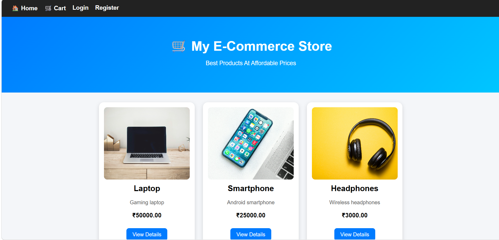
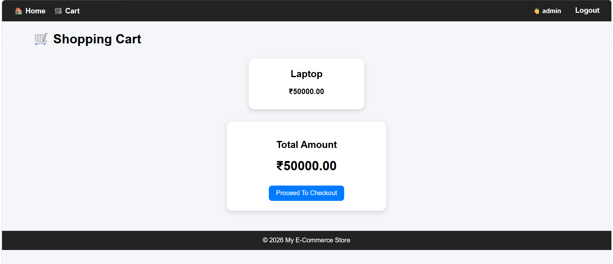
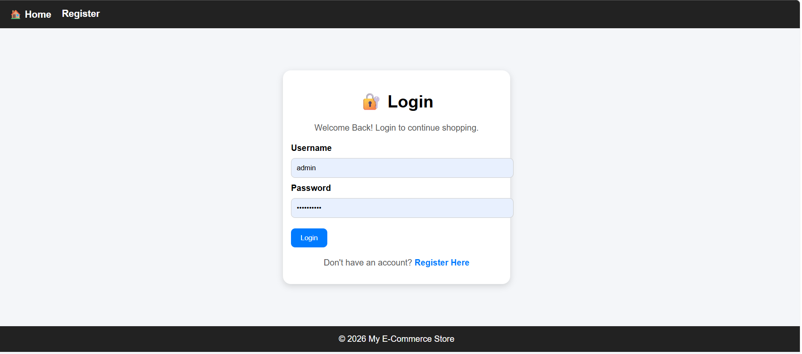
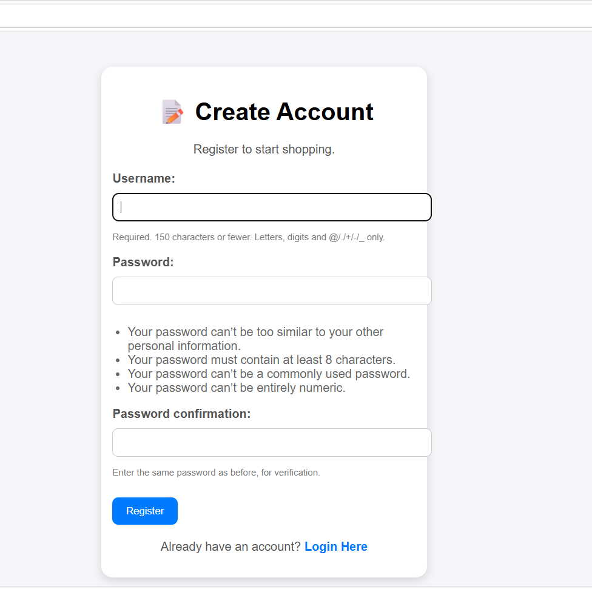
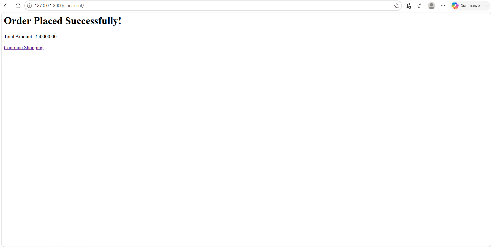
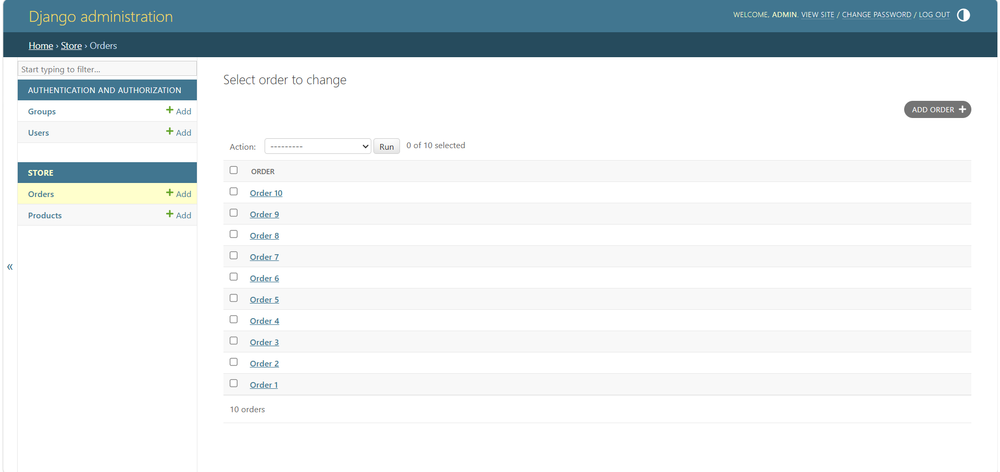
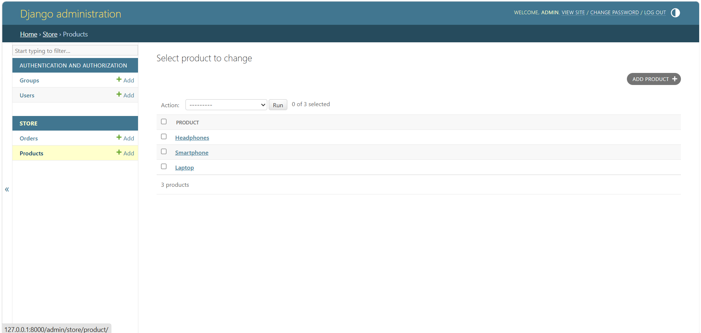

# 🛒 CodeAlpha E-Commerce Store

A simple E-Commerce Store built using Django.

## Features

✅ User Registration

✅ User Login & Logout

✅ Product Listing

✅ Product Details Page

✅ Shopping Cart

✅ Order Processing

✅ Admin Panel

## Technologies Used

- Python
- Django
- HTML
- CSS
- SQLite

## Project Screenshots

### Home Page


### Product Details


### Cart Page


### Login Page


### Register Page


### Checkout Page


### AdminOrders Page


### AdminProducts Page


## Run Project

```bash
python manage.py runserver
```

## Author

Dinkky